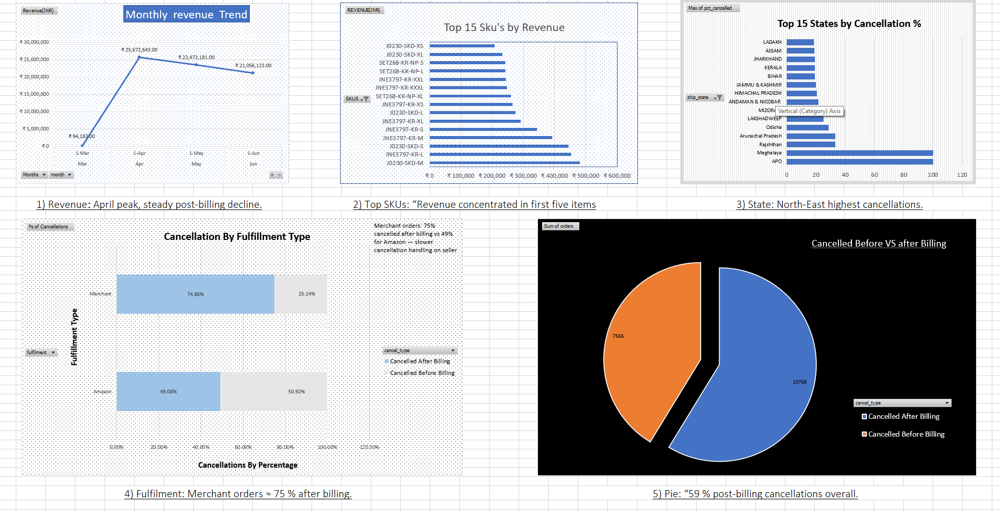

E-commerce Sales and Cancellations analysis (March-June 2022).

a. Project Overview
____________________

This project focuses on analysiing Amazon sales and cancellation trends from March to April, in the year 2022.
It was designed to showcase a complete data analysis/science workflow, from raw data cleaning with Python and Pandas to Sql quering in Postgressql(PgAdmin), and then summarizing and visualising in Excel and Tableau.

This analysis focuses on uncovering:
1) Revenue by month.
2) Top 15 Skus by Sales.
3) Cancellation statistics by states.
4) Cancellation statistics by billing timing, pre vs post.
5) Fulfillment performance, Amazon vs Merchant.

b. Tools Used
_______________

1) PostgresSql with PgAdmin.
2) Python with Numpy and Pandas.
3) Excel.
4) Tableau Public.

c. Workflow
_____________

1) Data Cleaning: Removed nulls, standardized fulfillment logic, and formatted dates in Python.

2) SQL Analysis: Wrote queries to analyze monthly revenue, SKU performance, cancellation rates, and fulfillment splits.

3) Excel Visualization: Built pivot charts to explore early patterns and validate metrics.

4) Tableau Dashboard: Combined key insights into an interactive dashboard summarizing sales trends and cancellations.

d. Key Insights
________________

1) Revenue peaked in April at ₹25.6M before seasonal decline.

2) Top 5 SKUs contributed over 50% of total sales — strong concentration.

3) North-East and island states showed highest cancellation rates.

4) ~59% of cancellations occurred after billing, suggesting refund-stage drop-offs.

5) Merchant-fulfilled orders had higher post-billing cancellations (≈75%) than Amazon-fulfilled (≈49%).

e. Project Structure
_____________________

E-COMMERCE PROJECT/
│
├── data/
│   └── raw/
│       ├── Amazon Sale Report.csv
│       ├── Cloud Warehouse.csv
│       ├── Expense IIGF.csv
│       ├── International Sale Report.csv
│       ├── May-2022.csv
│       └── P L March 2021.csv
│
├── export/
│   ├── cancellations_story.csv
│   ├── monthly_revenue.csv
│   ├── TOP_SKUS_BY_REVENUE.csv
│   ├── cancellations_by_state.csv
│   ├── cancellation_pre_post_billing.csv
│   └── cancellations_by_fulfillment.csv
│
├── docs/
│   ├── schema_audit.txt
│   ├── EXCEL_DASHBOARD_SUMMARY.png
│   └── Tableau_Dashboard_Summary.png
│
├── EXCEL/
│   └── Project.xlsx
│
├── python/
│   ├── data_cleaning.py
│   └── intro.py
│
├── sql/
│   ├── monthly_revenue.sql
│   ├── cancellations_by_state.sql
│   ├── cancellations_story.sql
│   ├── cancellation_pre_post_billing.sql
│   └── TOP_SKUS_BY_REVENUE.sql
│
├── tableau/
│   └── Project_amazon_sales_analysis.twbx
│
└── README.md

f. Excel Dashboard Preview
___________________________

Initial exploratory dashboard built in Excel using Pivot Charts and summary annotations.

g. Tableau Dashboard Preview
_____________________________

Final Tableau dashboard integrating all major KPIs and insights.

-📎 View on Tableau Public- https://public.tableau.com/app/profile/akshat.verma12/viz/Project_amazon_sales_analysis/Analysis_summary

👤 Author

Akshat
📈 Data Analytics | SQL | Python | Excel | Tableau
📧 theconquerer357.email@gmail.com

