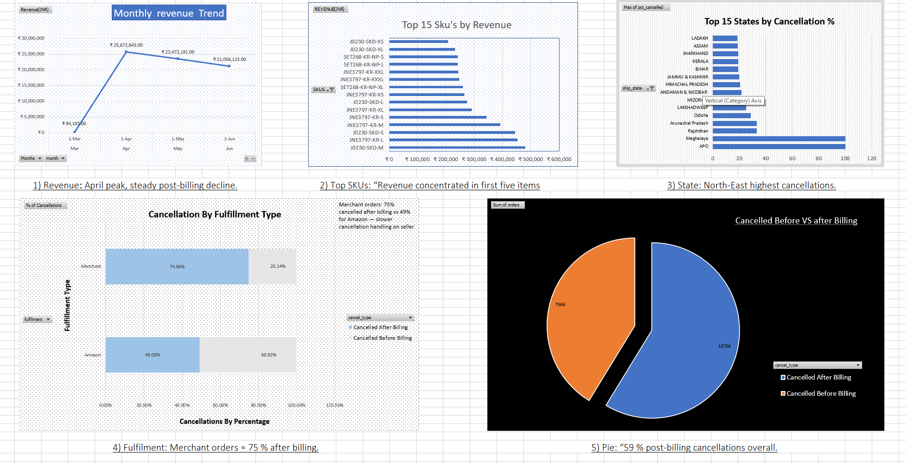
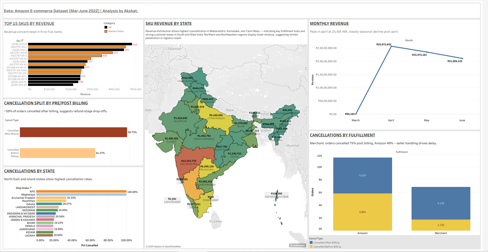

E-commerce Sales and Cancellations analysis (March-June 2022).

a. Project Overview
____________________

This project focuses on analysiing Amazon sales and cancellation trends from March to April, in the year 2022.
It was designed to showcase a complete data analysis/science workflow, from raw data cleaning with Python and Pandas to Sql quering in Postgressql(PgAdmin), and then summarizing and visualising in Excel and Tableau.

This analysis focuses on uncovering:
1) Revenue by month.
2) Top 15 Skus by Sales.
3) Cancellation statistics by states.
4) Cancellation statistics by billing timing, pre vs post.
5) Fulfillment performance, Amazon vs Merchant.
6) Revenue of SKUS by state.

b. Tools Used
_______________

1) PostgresSql with PgAdmin.
2) Python with Numpy and Pandas.
3) Excel.
4) Tableau Public.

c. Workflow
_____________

1) Data Cleaning: Removed nulls, standardized fulfillment logic, and formatted dates in Python.

2) SQL Analysis: Wrote queries to analyze monthly revenue, SKU performance, cancellation rates, and fulfillment splits.

3) Excel Visualization: Built pivot charts to explore early patterns and validate metrics.

4) Tableau Dashboard: Combined key insights into an interactive dashboard summarizing sales trends and cancellations.

d. Insights
____________

Peak sales occurred in April 2022 (₹25.6M), followed by a steady seasonal decline post-billing.

Revenue concentration is high across a few SKUs and regions — top 5 SKUs and top 3 states (Maharashtra, Karnataka, Tamil Nadu) drive most sales.

Cancellation behavior: ~59% of cancellations occur after billing, pointing toward refund-stage drop-offs or fulfillment delays.

Fulfillment performance: Merchant-handled orders show higher post-billing cancellations (~75%), indicating seller-side dispatch or QC bottlenecks.

Regional imbalance: North-East and Island states show disproportionately high cancellation rates — likely due to logistic limitations or limited serviceability.

e. Recommendations
____________________

Optimize logistics in North-East and Island regions — improve delivery SLAs and communication during checkout.

Review seller performance for Merchant-fulfilled orders; consider shifting high-volume SKUs to Amazon-fulfillment.

Encourage SKU diversification — promote lower-performing SKUs in high-revenue regions to balance sales.

Introduce predictive cancellation scoring using historical order behavior to flag risky orders pre-billing.

Maintain April-level engagement strategies (ads, offers) into later months to stabilize revenue.

f. Project Structure
_____________________

E-COMMERCE-PROJECT/
│
├── data/
│   ├── raw/                          # Original unprocessed CSV exports
│   │   ├── Amazon Sale Report.csv
│   │   ├── Cloud Warehouse.csv
│   │   ├── Expense IIGF.csv
│   │   ├── International Sale Report.csv
│   │   ├── May-2022.csv
│   │   └── P&L March 2021.csv
│   │
│   ├── export/                       # Cleaned datasets used for analysis
│   │   ├── cancellations_by_state.csv
│   │   ├── cancellation_pre_post_billing.csv
│   │   ├── cancellations_story.csv
│   │   ├── monthly_revenue.csv
│   │   ├── TOP_SKUS_BY_REVENUE.csv
│   │   └── sku_sales_by_state.csv
│
├── sql/                              # PostgreSQL queries for metrics generation
│   ├── monthly_revenue.sql
│   ├── top_skus_by_revenue.sql
│   ├── cancellations_by_state.sql
│   ├── cancellations_by_fulfillment.sql
│   ├── cancellation_split_pre_post.sql
│   └── sku_sales_by_state.sql
│
├── python/                           # Supporting scripts for data preprocessing
│   ├── data_cleaning.py
│   └── intro.py
│
├── EXCEL/                            # Excel dashboard and visual summary
│   ├── Project.xlsx
│   └── EXCEL_DASHBOARD_SUMMARY.png
│
├── Tableau/                          # Tableau workbook and interactive visuals
│   ├── Project_amazon_sales_analysis.twbx
│   └── Tableau_Dashboard_SUMMARY.png
│
├── docs/                             # Documentation and metadata
│   ├── schema_audit.txt
│   └── README.md
│
├── README.md                         # Main documentation

Dashboard Previews

Excel Dashboard Summary
Exploratory dashboard built with pivot charts and calculated KPIs.

Tableau Dashboard Summary

Link: https://public.tableau.com/app/profile/akshat.verma12/viz/Project_amazon_sales_analysis/Analysis_summary

Author:

Akshat Verma
Data Analytics | SQL | Python | Excel | Tableau
Email: theconquerer357@gmail.com

LinkedIn: https://www.linkedin.com/in/akshat-verma-b5284a38a/
GitHub: https://github.com/conquerer357/E-COMMERCE-PROJECT
